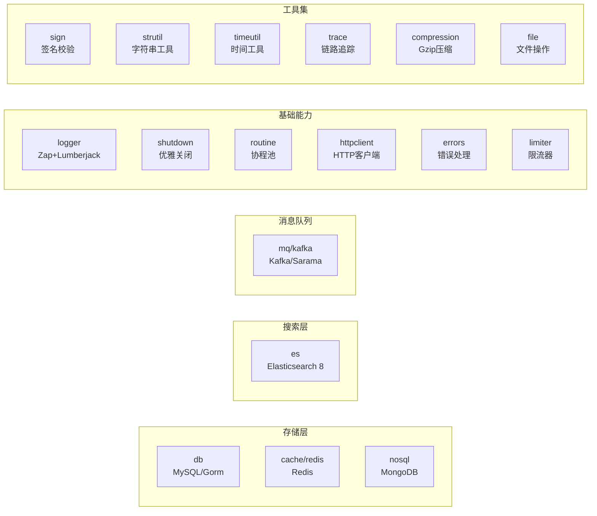

<div align="center">

# pkg

**Go-Search 核心基础设施库 — 17 个独立组件，对常用中间件与关键能力进行高度抽象与统一封装**

[](https://golang.org)     [](https://www.elastic.co)     [](https://kafka.apache.org)     [](https://redis.io)     [](https://gorm.io)     [](LICENSE)

</div>

---

> `pkg` 是 [Go-Search](https://github.com/HeRedBo/go-search) 项目的核心基础设施库，基于 Golang 开发，对后端开发中常用的中间件和组件进行了高度抽象与统一封装。
> **各子包独立管理依赖（Go Module），可按需引入**，大幅提升微服务开发效率、代码规范性与健壮性。

---

## ✨ 设计亮点

<table>
<tr>
<td width="50%">

#### 🧱 独立模块化
17 个组件各自维护独立 `go.mod`，按需引入，不产生额外依赖，真正的"零侵入"

</td>
<td width="50%">

#### ⚡ BulkProcessor 批量写入
ES 批量操作异步提交，支持自定义 Workers、Flush 间隔和批大小，高吞吐低延迟

</td>
</tr>
<tr>
<td>

#### 🔒 优雅关闭
监听 SIGQUIT/SIGINT/SIGTERM 系统信号，支持注册多个关闭钩子，确保资源安全释放

</td>
<td>

#### 📋 结构化日志
Zap + Lumberjack 封装，Info/Warn 分文件存储，支持文件轮转与自定义时间格式

</td>
</tr>
<tr>
<td>

#### 🔑 幂等写入
基于 external version type 实现 ES 文档写入幂等性，避免并发场景数据乱序覆盖

</td>
<td>

#### 🔄 Consumer Group
Kafka 基于 Sarama Consumer Group，多分区并行消费，Handler 返回值控制位移提交

</td>
</tr>
</table>

---

## 📦 组件一览



<table>
<thead>
<tr>
<th>分类</th>
<th>组件</th>
<th>包路径</th>
<th>核心能力</th>
</tr>
</thead>
<tbody>
<tr>
<td rowspan="3" align="center"><strong>🗄️ 存储</strong></td>
<td></td>
<td><code>db</code></td>
<td>Gorm 封装，多客户端管理，连接池配置</td>
</tr>
<tr>
<td></td>
<td><code>cache</code> / <code>redis</code></td>
<td>go-redis 封装，Bitmap，慢查询追踪，多客户端</td>
</tr>
<tr>
<td></td>
<td><code>nosql</code></td>
<td>mongo-driver 封装，连接池与多客户端管理</td>
</tr>
<tr>
<td align="center"><strong>🔍 搜索</strong></td>
<td></td>
<td><code>es</code></td>
<td>BulkProcessor 批量写入、完整 CRUD、索引管理、版本控制、ES8 HTTPS</td>
</tr>
<tr>
<td align="center"><strong>📨 消息队列</strong></td>
<td></td>
<td><code>mq</code> / <code>kafka</code></td>
<td>Consumer Group、同步/异步 Producer、消息处理回调</td>
</tr>
<tr>
<td rowspan="6" align="center"><strong>⚙️ 基础能力</strong></td>
<td></td>
<td><code>logger</code></td>
<td>Zap + Lumberjack，文件轮转，级别分文件，自定义格式</td>
</tr>
<tr>
<td></td>
<td><code>shutdown</code></td>
<td>多钩子注册，SIGQUIT/SIGINT/SIGTERM 信号处理</td>
</tr>
<tr>
<td></td>
<td><code>routine</code></td>
<td>高性能 Goroutine Pool，控制并发数，避免泄露</td>
</tr>
<tr>
<td></td>
<td><code>httpclient</code></td>
<td>重试策略，超时控制，链式调用</td>
</tr>
<tr>
<td></td>
<td><code>errors</code></td>
<td>统一错误码，堆栈信息追踪</td>
</tr>
<tr>
<td></td>
<td><code>limiter</code></td>
<td>四种限流算法，单机/Redis 分布式，统一工厂模式</td>
</tr>
<tr>
<td rowspan="6" align="center"><strong>🔧 工具集</strong></td>
<td></td>
<td><code>sign</code></td>
<td>HMAC 签名校验封装</td>
</tr>
<tr>
<td></td>
<td><code>strutil</code></td>
<td>常用字符串操作集</td>
</tr>
<tr>
<td></td>
<td><code>timeutil</code></td>
<td>时间格式化与操作集</td>
</tr>
<tr>
<td></td>
<td><code>trace</code></td>
<td>慢查询追踪与日志记录</td>
</tr>
<tr>
<td></td>
<td><code>compression</code></td>
<td>Gzip 压缩/解压封装</td>
</tr>
<tr>
<td></td>
<td><code>file</code></td>
<td>文件读写工具封装</td>
</tr>
</tbody>
</table>

---

## 🔍 核心组件详解

<details>
<summary><strong>📌 Elasticsearch 封装（es）</strong></summary>

| 特性 | 说明 |
| :--- | :--- |
| 多客户端管理 | 支持命名客户端，可同时连接多个 ES 集群 |
| BulkProcessor | 异步批量写入，可配置 Workers 数量、Flush 间隔、批次大小与文档数 |
| 索引缓存 | 本地缓存索引存在性检测，减少不必要的 API 调用 |
| 版本控制 | 基于 external version type 实现文档写入幂等性，避免数据乱序 |
| 完整 CRUD | Create / BulkCreate / Update / Upsert / Delete / DeleteByQuery 全覆盖 |
| HTTPS 支持 | 内置 TLS 跳过证书验证的 HTTP Client，适配 ES8 默认 HTTPS |

</details>

<details>
<summary><strong>📌 Kafka 封装（mq / kafka）</strong></summary>

| 特性 | 说明 |
| :--- | :--- |
| Consumer Group | 基于 Sarama Consumer Group 实现，支持多分区并行消费 |
| 消息处理回调 | 自定义 Handler 函数，返回 `(bool, error)` 控制消费位移提交 |
| 同步 Producer | 同步发送，适合对可靠性要求高的场景 |
| 异步 Producer | 异步发送，适合高吞吐场景 |

</details>

<details>
<summary><strong>📌 日志库封装（logger）</strong></summary>

| 特性 | 说明 |
| :--- | :--- |
| 文件轮转 | 基于 Lumberjack 实现日志文件自动切割 |
| 级别分离 | Info / Warn 日志分文件存储，便于监控告警 |
| 自定义格式 | 支持自定义时间布局与输出路径 |
| 结构化输出 | 基于 Zap，JSON 格式结构化日志，适合日志采集系统 |

</details>

<details>
<summary><strong>📌 优雅关闭（shutdown）</strong></summary>

| 特性 | 说明 |
| :--- | :--- |
| 信号监听 | 监听 SIGQUIT / SIGINT / SIGTERM 三种操作系统信号 |
| 多钩子注册 | 支持注册多个关闭钩子函数，按序执行 |
| 资源安全释放 | 确保 DB 连接、MQ 连接、日志 flush 等资源安全关闭 |

</details>

<details>
<summary><strong>📌 限流器（limiter）</strong></summary>

| 特性 | 说明 |
| :--- | :--- |
| 令牌桶 | 按速率生成令牌，允许突发流量，适合一般限流场景 |
| 漏桶 | 固定速率漏水，平滑流量输出，适合流量整形场景 |
| 固定窗口 | 时间窗口内计数，实现简单，存在窗口边界突刺问题 |
| 滑动窗口 | 基于时间戳滑动，精度高于固定窗口，解决边界突刺 |
| 单机 / Redis | 自动选择：传 Redis 客户端为分布式限流，传 nil 为单机限流 |
| 统一工厂 | `NewLimiter()` 统一入口，算法 + 单机/Redis 自动路由 |

</details>

---

## 🧩 项目结构

```
pkg/
├── cache/            # Redis 缓存封装（Bitmap / 多客户端 / 慢查询）
├── compression/      # Gzip 压缩封装
├── db/               # MySQL/Gorm 封装（多客户端 / 连接池）
├── errors/           # 统一错误码与堆栈追踪
├── es/               # Elasticsearch 封装（BulkProcessor / 完整CRUD / 索引管理）
│   └── v8/           # ES8 相关扩展
├── file/             # 文件操作工具
├── httpclient/       # HTTP 客户端（重试 / 超时控制 / 链式调用）
├── kafka/            # Kafka 扩展封装
├── limiter/          # 限流器（令牌桶/漏桶/固定窗口/滑动窗口，单机+Redis）
│   ├── local/        # 单机限流实现
│   ├── redis/        # Redis 分布式限流实现
│   └── test/         # 限流器单元测试
├── logger/           # Zap+Lumberjack 日志封装（文件轮转 / 级别分离）
├── mq/               # Kafka Producer/Consumer Group 封装
├── nosql/            # MongoDB 封装（连接池 / 多客户端）
├── redis/            # Redis 操作封装
├── routine/          # 高性能协程池（控制并发 / 避免泄露）
├── shutdown/         # 优雅关闭（信号监听 / 多钩子注册）
├── sign/             # HMAC 接口签名校验
├── strutil/          # 字符串工具集
├── timeutil/         # 时间格式化与操作工具集
└── trace/            # 链路追踪（慢查询追踪）
```

---

## 🚀 快速使用

各子包作为独立 Go Module 管理，按需引入：

```bash
# 引入 ES 组件
go get github.com/HeRedBo/pkg/es

# 引入 Redis 缓存组件
go get github.com/HeRedBo/pkg/cache

# 引入 Kafka 消息队列组件
go get github.com/HeRedBo/pkg/mq

# 引入 MySQL 组件
go get github.com/HeRedBo/pkg/db

# 引入优雅关闭组件
go get github.com/HeRedBo/pkg/shutdown

# 引入日志组件
go get github.com/HeRedBo/pkg/logger

# 引入限流器组件
go get github.com/HeRedBo/pkg/limiter
```

---

## 🔗 关联项目

| 项目 | 说明 |
| :--- | :--- |
| [go-search](https://github.com/HeRedBo/go-search) | 项目总入口 |
| [shop-main](https://github.com/HeRedBo/shop-main) | 核心业务微服务 |
| [shop-search-api](https://github.com/HeRedBo/shop-search-api) | 搜索 API 微服务 |
| [order-consumer](https://github.com/HeRedBo/order-consumer) | 订单数据同步消费者 |
| [product-consumer](https://github.com/HeRedBo/product-consumer) | 商品数据同步消费者 |

---

<div align="center">

**Apache-2.0** License

</div>
