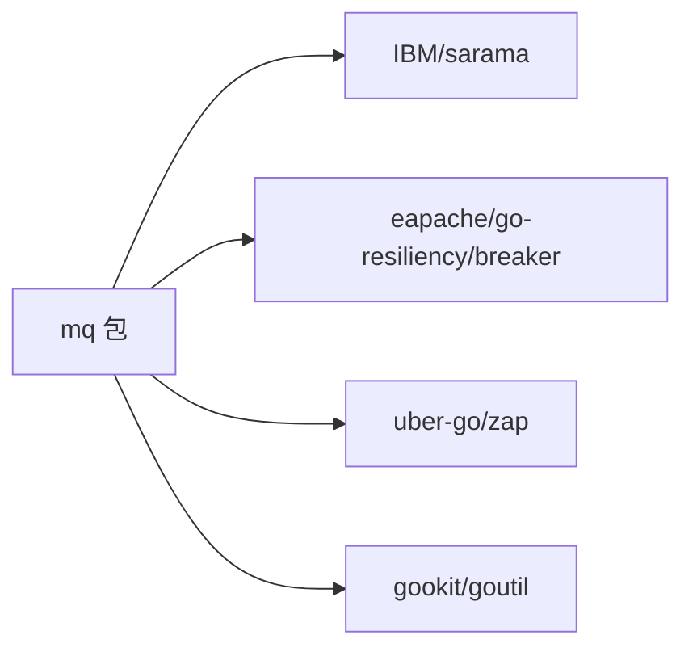
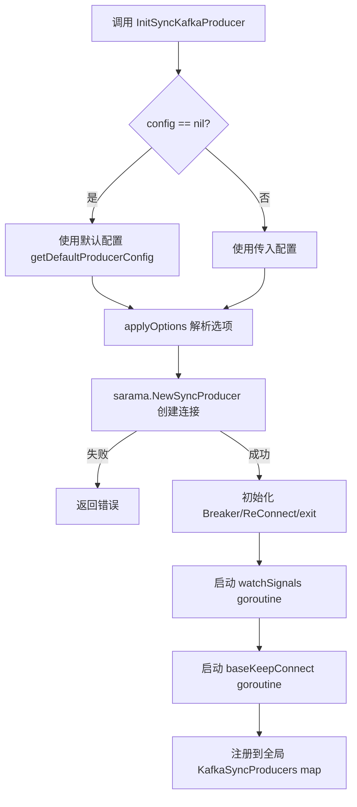
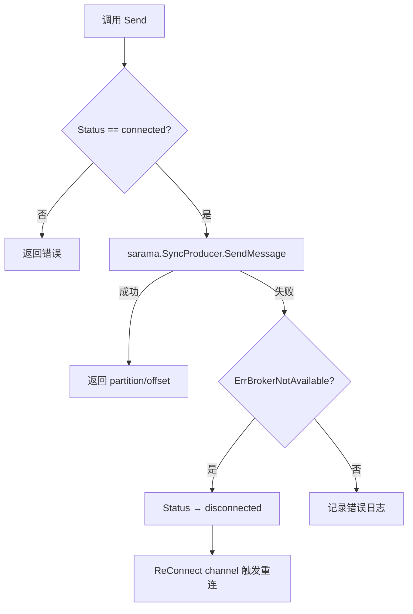
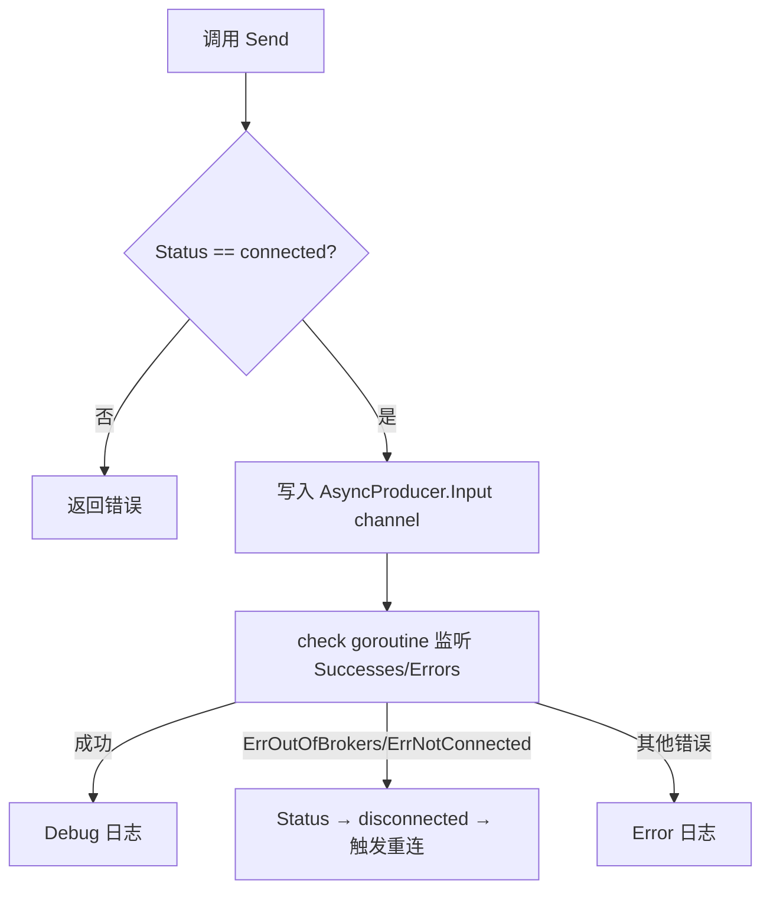
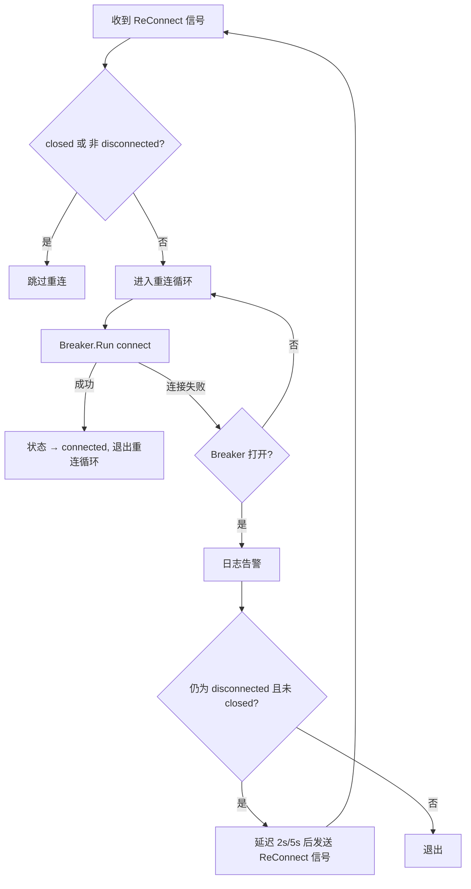
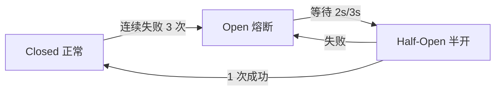
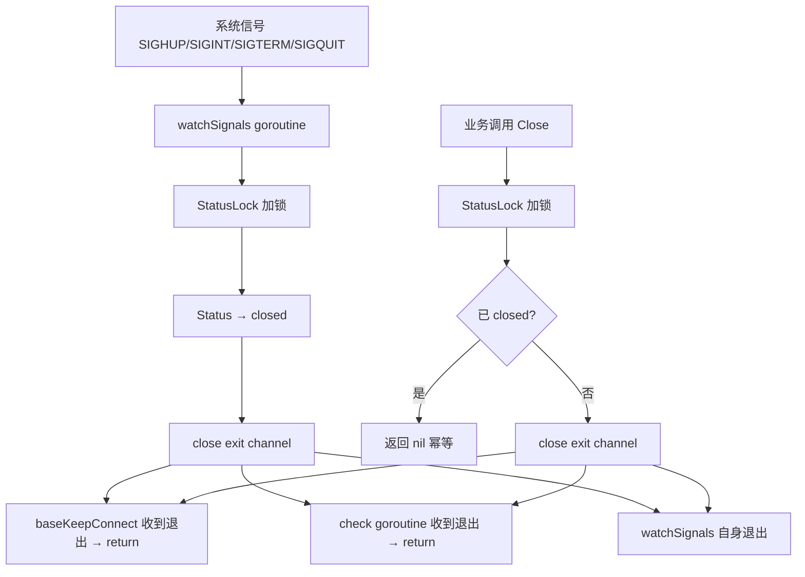

# MQ 包技术设计文档

## 1. 项目概述

### 功能定位

`mq` 是一个 Kafka 消息队列使用封装包，基于 [IBM/sarama](https://github.com/IBM/sarama) 客户端库，为业务层提供简洁、安全的 Kafka 读写能力。

### 核心能力

| 能力 | 说明 |
|------|------|
| 同步消息发送 | `SyncProducer.Send` / `SendMessages`，阻塞等待 Broker 确认 |
| 异步消息发送 | `AsyncProducer.Send`，写入 Input channel 即返回 |
| 消费者组消费 | `Consumer` 基于 `sarama.ConsumerGroup`，支持多 Topic |
| 自动重连 | 断连后自动触发重连，结合熔断器保护 |
| 熔断保护 | 连续失败达阈值后熔断，避免无效重连消耗资源 |
| 灵活日志 | 三级优先级链：Option 注入 > 全局 SetLogger > 默认控制台 |
| 优雅退出 | 统一信号监听 + `close(exit)` 广播，确保 goroutine 无泄漏 |

---

## 2. 整体架构图

### 结构体关系图

```mermaid
graph TB
    SP[SyncProducer] -->|嵌入| KP[KafkaProducer]
    AP[AsyncProducer] -->|嵌入| KP
    C[Consumer]

    KP -->|持有| SPs[SyncProducer]
    KP -->|持有| APs[AsyncProducer]
    KP -->|持有| BR[breaker.Breaker]
    KP -->|持有| LG[Logger]
    KP -->|持有| EXIT[exit chan struct{}]

    C -->|持有| CG[sarama.ConsumerGroup]
    C -->|持有| BR2[breaker.Breaker]
    C -->|持有| LG2[Logger]
    C -->|持有| EXIT2[exit chan struct{}]
    C -->|持有| H[consumerGroupHandler]
    H -->|回调| CB[KafkaMessageHandler]
```

### 模块依赖关系



---

## 3. 代码结构

### 文件职责表

| 文件 | 职责 |
|------|------|
| `kafka_producer.go` | 生产者核心：`KafkaProducer` 基础结构、`SyncProducer` / `AsyncProducer` 初始化与消息发送、自动重连、信号监听、Close |
| `kafka_consumer.go` | 消费者核心：`Consumer` 结构、消费者组初始化、消息消费循环、自动重连、信号监听、Close |
| `logger.go` | 日志系统：`Logger` 接口定义、全局/默认 Logger、`Option` 模式（`WithLogger`）、优先级解析 `getLogger` |
| `sarama_logger.go` | Sarama 日志适配器：`saramaZapLogger` 将 `sarama.StdLogger` 桥接到 `mq.Logger` |
| `mq_logger_test.go` | 日志系统单元测试：覆盖默认日志、全局注入、Option 优先级、适配器行为等 |

### 核心结构体和接口

```go
// 基础生产者结构（被 SyncProducer / AsyncProducer 嵌入）
type KafkaProducer struct {
    Name       string
    Hosts      []string
    Config     *sarama.Config
    Status     string
    Breaker    *breaker.Breaker
    ReConnect  chan bool
    StatusLock sync.Mutex
    log        Logger
    exit       chan struct{}
    closed     bool
}

// 同步生产者
type SyncProducer struct {
    KafkaProducer
    SyncProducer *sarama.SyncProducer
}

// 异步生产者
type AsyncProducer struct {
    KafkaProducer
    AsyncProducer *sarama.AsyncProducer
}

// 消费者
type Consumer struct {
    hosts      []string
    topics     []string
    config     *sarama.Config
    consumer   sarama.ConsumerGroup
    status     string
    groupID    string
    handler    *consumerGroupHandler
    breaker    *breaker.Breaker
    reConnect  chan bool
    statusLock sync.Mutex
    exit       chan struct{}
    closed     bool
    cancel     context.CancelFunc
    wg         sync.WaitGroup
    log        Logger
}

// 日志接口
type Logger interface {
    Info(msg string, fields ...zap.Field)
    Warn(msg string, fields ...zap.Field)
    Error(msg string, fields ...zap.Field)
    Debug(msg string, fields ...zap.Field)
}

// 消费者回调
type KafkaMessageHandler func(message *sarama.ConsumerMessage) (bool, error)
```

---

## 4. 设计模式详解

### 4.1 策略模式（Strategy Pattern）

**在哪里使用：**
- `connectFunc` 类型定义 + `baseKeepConnect` 方法
- `SyncProducer.syncConnect` 和 `AsyncProducer.asyncConnect` 作为具体策略函数

**解决什么问题：**
重构前，同步和异步生产者的 `keepConnect` 方法有 95% 的重复代码（重连循环、熔断判断、退出检测等），仅连接创建逻辑不同。

**如何工作：**

```go
// 策略函数类型
type connectFunc func() error

// 公共重连模板——接收策略函数作为参数
func (kp *KafkaProducer) baseKeepConnect(connect connectFunc, typeName string) {
    // ... 统一的重连循环逻辑
    err := kp.Breaker.Run(connect) // 调用具体策略
    // ...
}

// 同步连接策略
func (sp *SyncProducer) syncConnect() error {
    producer, err := sarama.NewSyncProducer(sp.Hosts, sp.Config)
    // ... 状态更新
}

// 异步连接策略
func (ap *AsyncProducer) asyncConnect() error {
    producer, err := sarama.NewAsyncProducer(ap.Hosts, ap.Config)
    // ... 状态更新
}
```

初始化时传入对应策略：

```go
go syncProducer.baseKeepConnect(syncProducer.syncConnect, "sync")
go asyncProducer.baseKeepConnect(asyncProducer.asyncConnect, "async")
```

### 4.2 Option 模式（Functional Options）

**在哪里使用：**
- `Option` 函数类型 + `mqOptions` 结构体
- `WithLogger(l Logger)` 选项函数
- `applyOptions` 合并所有选项
- `InitSyncKafkaProducer` / `InitAsyncKafkaProducer` / `StartKafkaConsumer` 接受 `opts ...Option` 可变参数

**解决什么问题：**
为初始化函数提供灵活的可选项注入能力，未来新增选项（如超时、重试策略等）时无需修改函数签名，不破坏 API 兼容性。

**如何工作：**

```go
type Option func(*mqOptions)

func WithLogger(l Logger) Option {
    return func(o *mqOptions) { o.logger = l }
}

// 使用示例
mq.InitSyncKafkaProducer("name", hosts, nil, mq.WithLogger(zapLogger))
```

### 4.3 熔断器模式（Circuit Breaker）

**在哪里使用：**
- `KafkaProducer.Breaker`（生产者重连）
- `Consumer.breaker`（消费者重连）

**参数配置：**

| 参数 | 生产者 | 消费者 | 含义 |
|------|--------|--------|------|
| 失败阈值 | 3 | 3 | 连续失败 3 次后熔断 |
| 成功阈值 | 1 | 1 | 半开状态 1 次成功即恢复 |
| 超时时间 | 2s | 3s | 熔断后等待多久进入半开 |

**解决什么问题：**
Kafka Broker 不可用时，避免高频重连消耗 CPU 和网络资源。熔断器打开后延迟 2s/5s 再尝试，给 Broker 恢复时间。

**如何工作：**

```go
// 重连循环中使用熔断器
err := kp.Breaker.Run(connect)
switch err {
case nil:
    // 重连成功
case breaker.ErrBreakerOpen:
    // 熔断器打开，延迟后再次尝试
    time.AfterFunc(2*time.Second, func() {
        kp.ReConnect <- true
    })
default:
    // 连接失败但熔断器未打开，继续重试
}
```

### 4.4 统一退出机制（Broadcast Exit）

**在哪里使用：**
- `KafkaProducer.exit chan struct{}` + `close(kp.exit)` 广播
- `Consumer.exit chan struct{}` + `close(c.exit)` 广播
- 各组件的 `watchSignals()` 方法

**解决什么问题：**
1. **信号竞争 Bug**：重构前每个 goroutine 独立调用 `signal.Notify`，多个 goroutine 竞争同一信号，可能导致部分 goroutine 无法收到退出通知
2. **goroutine 泄漏**：部分 goroutine 未监听退出信号，导致进程退出后 goroutine 残留

**如何工作：**

```go
// 1. 统一信号监听（只注册一次）
func (kp *KafkaProducer) watchSignals() {
    signals := make(chan os.Signal, 1)
    signal.Notify(signals, syscall.SIGHUP, syscall.SIGINT, syscall.SIGTERM, syscall.SIGQUIT)
    select {
    case <-signals:
        close(kp.exit) // 广播退出
    case <-kp.exit:
        // 已通过 Close() 触发退出
    }
}

// 2. 所有 goroutine 监听 exit 通道
func (kp *KafkaProducer) baseKeepConnect(...) {
    for {
        select {
        case <-kp.exit:  // 收到广播，退出
            return
        case <-kp.ReConnect:
            // 重连逻辑...
        }
    }
}

// 3. Close() 也通过 close(exit) 广播
func (sp *SyncProducer) Close() error {
    close(syncProducer.exit) // 所有监听 exit 的 goroutine 都会收到
    // ...
}
```

### 4.5 回调模式（Callback Pattern）

**在哪里使用：**
- `KafkaMessageHandler` 回调函数类型
- `consumerGroupHandler.callback` 字段
- `StartKafkaConsumer` 接收 `f KafkaMessageHandler` 参数

**解决什么问题：**
将消费者消息处理逻辑与底层消费循环解耦。业务方只需提供处理函数，无需关心 ConsumerGroup 的 Session/Cleanup/ConsumeClaim 生命周期。

**如何工作：**

```go
// 业务方定义处理逻辑
handler := func(msg *sarama.ConsumerMessage) (bool, error) {
    // 处理消息
    return true, nil // true = 提交 offset
}

// 启动消费者时注入
consumer, _ := mq.StartKafkaConsumer(hosts, topics, groupID, nil, handler)
```

内部消费循环调用回调：

```go
func (h *consumerGroupHandler) ConsumeClaim(session sarama.ConsumerGroupSession, claim sarama.ConsumerGroupClaim) error {
    for message := range claim.Messages() {
        if commit, err := h.callback(message); commit {
            session.MarkMessage(message, "")
        }
    }
    return nil
}
```

### 4.6 适配器模式（Adapter Pattern）

**在哪里使用：**
- `saramaZapLogger` 结构体实现 `sarama.StdLogger` 接口
- `SetSaramaLogger(l Logger)` 函数

**解决什么问题：**
sarama 内部使用 `sarama.StdLogger`（接口含 `Print`/`Printf`/`Println`）输出日志。通过适配器将 sarama 的底层日志（分区重平衡、连接建立、offset 提交等）统一桥接到 `mq.Logger` → Zap → 文件/ELK。

**如何工作：**

```go
type saramaZapLogger struct {
    l Logger
}

// 将 sarama.StdLogger 的三个方法全部代理到 mq.Logger.Debug
func (s *saramaZapLogger) Print(v ...interface{})  { s.l.Debug(fmt.Sprint(v...)) }
func (s *saramaZapLogger) Printf(format string, v ...interface{}) {
    s.l.Debug(fmt.Sprintf(format, v...))
}
func (s *saramaZapLogger) Println(v ...interface{}) { s.l.Debug(fmt.Sprint(v...)) }

// 注入
mq.SetSaramaLogger(zapLogger)
sarama.Logger = &saramaZapLogger{l: zapLogger}
```

---

## 5. 核心流程图

### 5.1 初始化流程



### 5.2 消息发送流程

**同步发送：**



**异步发送：**



### 5.3 自动重连流程（含熔断器状态转换）



**熔断器状态机：**



### 5.4 优雅退出流程



---

## 6. 技术要点

### 信号统一处理

每个 Producer/Consumer 实例只启动一个 `watchSignals` goroutine，内部调用一次 `signal.Notify`。收到信号后通过 `close(exit)` 广播给所有关联 goroutine，避免多 goroutine 竞争同一信号导致的竞争 Bug。

### 并发安全

| 场景 | 保护方式 |
|------|----------|
| 全局 `KafkaSyncProducers` / `KafkaAsyncProducers` map | `sync.RWMutex`（读 `RLock`，写 `Lock`） |
| `Status` 字段读写 | `StatusLock sync.Mutex` |
| `closed` 字段读写 | 在 `StatusLock` 保护下操作 |

### Close 幂等

```go
func (sp *SyncProducer) Close() error {
    sp.StatusLock.Lock()
    defer sp.StatusLock.Unlock()
    if sp.isClosed() {
        return nil  // 已关闭，直接返回
    }
    sp.closed = true
    close(sp.exit)  // 只执行一次
    // ...
}
```

`closed` 字段确保 `close(exit)` 只被调用一次，防止重复 close channel 导致 panic。

### 日志优先级链

```
Option 注入（WithLogger）> 全局 SetLogger > 默认控制台（defaultLogger）
```

```go
func getLogger(opt Logger) Logger {
    if opt != nil {       // 1. Option 注入（最高优先级）
        return opt
    }
    if globalLogger != nil { // 2. 全局 SetLogger
        return globalLogger
    }
    return stdDefault       // 3. 默认控制台
}
```

---

## 7. 优化前后对比

### 代码量对比

| 指标 | 重构前 | 重构后 | 变化 |
|------|--------|--------|------|
| `keepConnect` 方法数 | 2 个（sync/async 各一份） | 1 个 `baseKeepConnect` | -50% |
| `keepConnect` 代码行数 | ~110 行（两份） | ~70 行（一份） | -36% |
| `signal.Notify` 注册次数 | 每个 goroutine 各注册一次（4+ 次） | 每个实例仅 1 次 | 统一为 1 次 |

### 安全性提升

| 问题 | 重构前 | 重构后 |
|------|--------|--------|
| 信号竞争 | 多 goroutine 竞争同一 signal channel，部分 goroutine 可能收不到退出信号 | 统一 `watchSignals` + `close(exit)` 广播，所有 goroutine 均能收到 |
| 并发保护 | `Status` 字段部分场景无锁读写 | 所有 `Status` / `closed` 读写均在 `StatusLock` 保护下 |
| Close 重复调用 | 可能 panic（重复 close channel） | `closed` 字段保证幂等 |

### 可维护性提升

| 维度 | 重构前 | 重构后 |
|------|--------|--------|
| 新增生产者类型 | 需完整复制 keepConnect 逻辑 | 只需提供 `connectFunc` 策略函数 |
| 日志配置 | 硬编码或全局统一 | 支持实例级、全局级、默认三级配置 |
| 退出管理 | 各 goroutine 独立处理信号 | 统一 exit channel 广播模型 |
