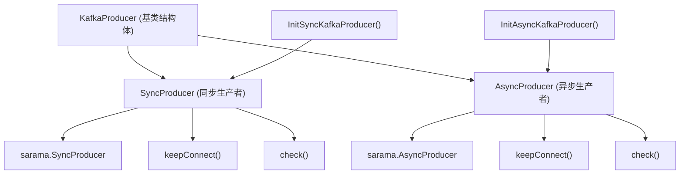
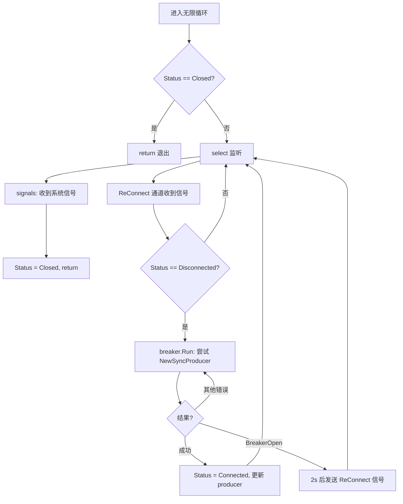
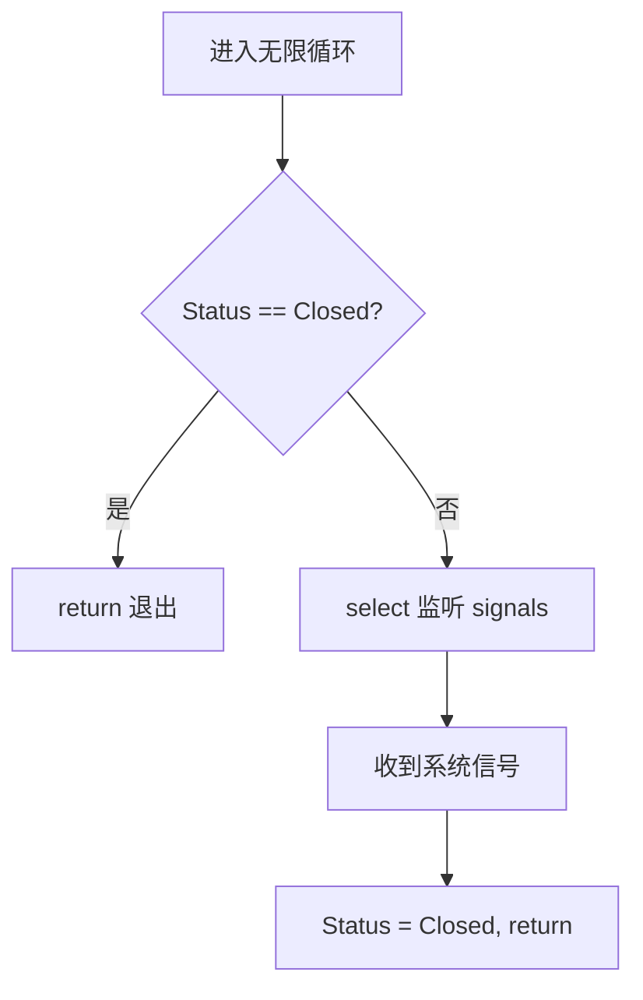
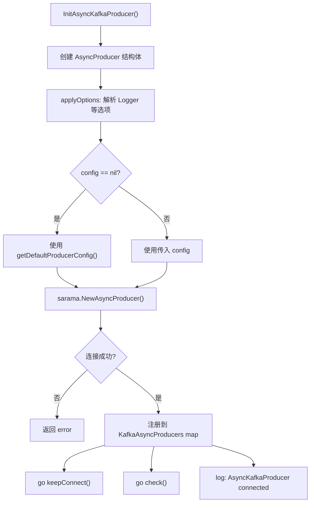
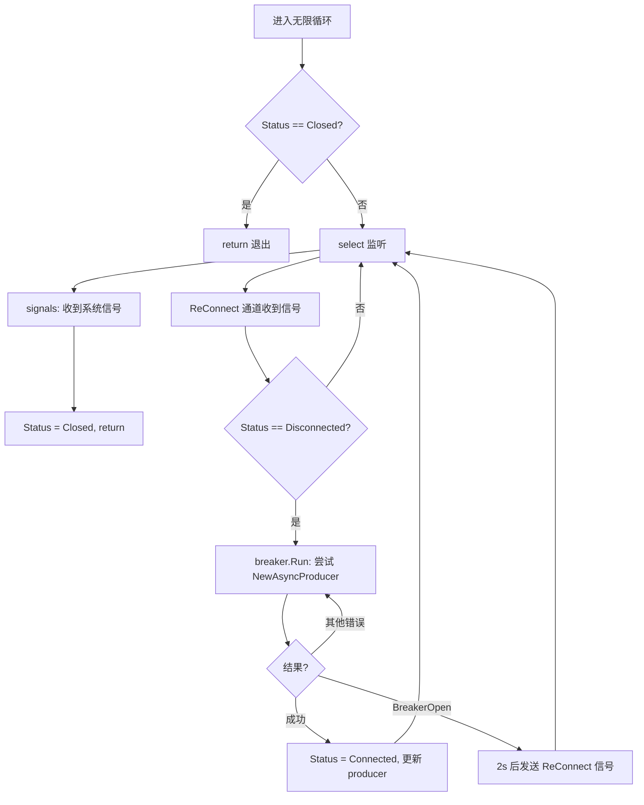
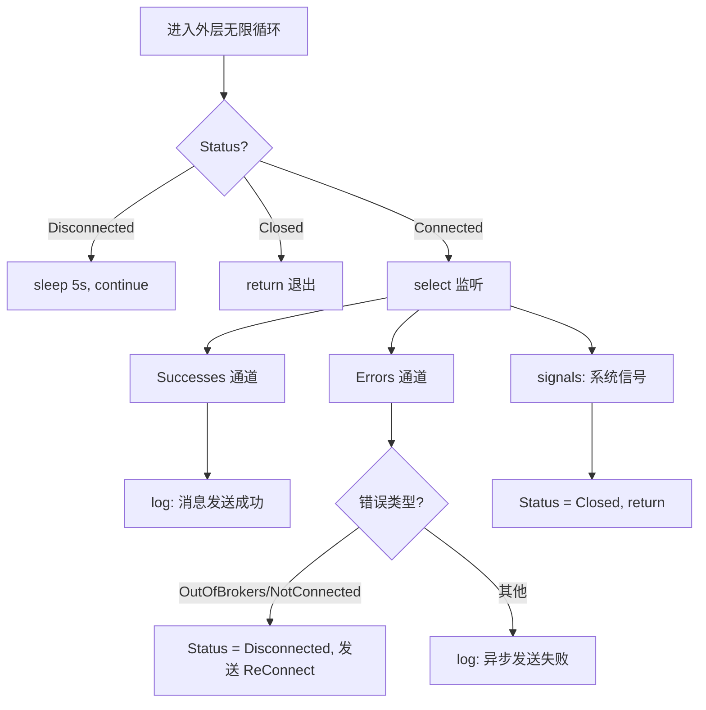
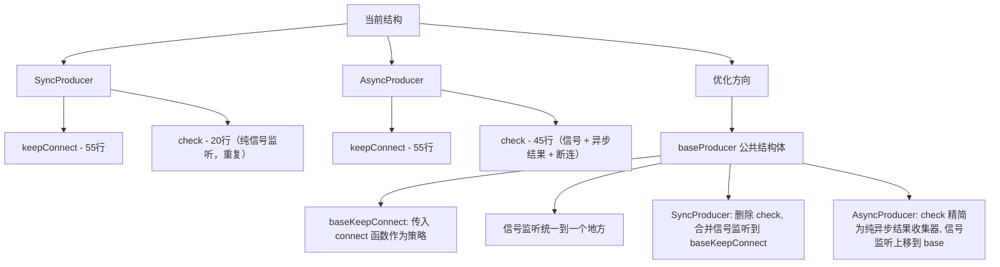
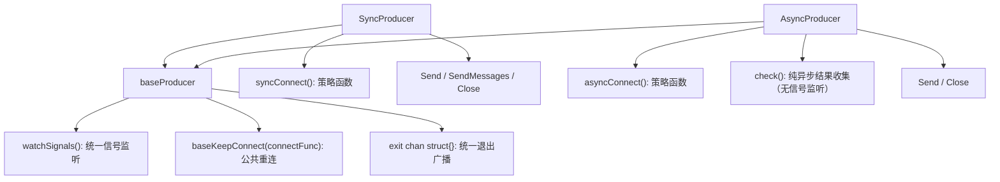

# Kafka 生产者封装 — 架构梳理与优化方向

## 一、整体结构



### 核心文件

| 文件 | 职责 |
|------|------|
| `kafka_producer.go` | 生产者封装：SyncProducer / AsyncProducer 的初始化、重连、状态检查、消息发送 |
| `logger.go` | 日志抽象：Logger 接口、全局注入、Option 模式注入 |

### 结构体关系

```
KafkaProducer          ← 公共字段（Name, Hosts, Config, Status, Breaker, ReConnect, StatusLock, log）
├── SyncProducer       ← 嵌入 KafkaProducer + *sarama.SyncProducer
└── AsyncProducer      ← 嵌入 KafkaProducer + *sarama.AsyncProducer
```

---

## 二、SyncProducer 流程图


### SyncProducer.keepConnect()



### SyncProducer.check()



> **注意：SyncProducer.check() 的唯一职责就是监听系统信号，而这个功能在 keepConnect 中已经存在。**

---

## 三、AsyncProducer 流程图



### AsyncProducer.keepConnect()



### AsyncProducer.check()



> **注意：AsyncProducer.check() 承担了三重职责：信号监听 + 异步发送结果收集 + 断连检测。**

---

## 四、方法对比分析

### 4.1 keepConnect 对比

| 维度 | SyncProducer.keepConnect | AsyncProducer.keepConnect |
|------|--------------------------|---------------------------|
| 系统信号监听 | ✅ `signal.Notify(signals, ...)` | ✅ 完全相同 |
| 退出条件 | `Status == Closed` | `Status == Closed` |
| 重连逻辑 | `breaker.Run` → `NewSyncProducer` | `breaker.Run` → `NewAsyncProducer` |
| 重连成功赋值 | `SyncProducer = &producer` | `AsyncProducer = &producer` |
| BreakerOpen 等待 | 2s | 2s |
| 代码行数 | ~55 行 | ~55 行 |
| **差异点** | 仅在于**创建函数和赋值目标不同** | 仅在于**创建函数和赋值目标不同** |

**结论：两个 `keepConnect` 逻辑 95% 相同，具备抽取条件。**

### 4.2 check 对比

| 维度 | SyncProducer.check | AsyncProducer.check |
|------|--------------------|-----------------------|
| 系统信号监听 | ✅ 唯一职责 | ✅ 职责之一 |
| Successes 通道监听 | ❌ 无 | ✅ 有 |
| Errors 通道监听 | ❌ 无 | ✅ 有（含断连检测） |
| 断开重连触发 | ❌ 无 | ✅ 有 |
| 外层 Disconnected sleep | ❌ 无 | ✅ 有 |
| 代码行数 | ~20 行 | ~45 行 |
| **本质** | **纯粹的信号监听器** | **信号监听 + 异步结果收集 + 断连检测** |

**结论：SyncProducer.check() 完全多余（与 keepConnect 信号监听重复）；AsyncProducer.check() 有独立价值但混入了信号监听。**

---

## 五、现有问题总结

### 问题 1：keepConnect 高度重复

两个 `keepConnect` 唯一差异是：
- 创建连接的函数不同（`NewSyncProducer` vs `NewAsyncProducer`）
- 赋值的目标字段不同（`SyncProducer` vs `AsyncProducer`）

完全可以通过**策略模式**（传入 connect 函数）抽成一个公共方法。

### 问题 2：check 职责不对等

- **SyncProducer.check** 只做信号监听 → 和 `keepConnect` 里的信号监听**完全重复**
- **AsyncProducer.check** 做信号监听 + 异步结果收集 + 断连检测 → 有独立存在的价值，但混入了信号监听

### 问题 3：信号通道重复创建（潜在 Bug）

`keepConnect` 和 `check` 各自创建了独立的 `signals` channel 并调用 `signal.Notify`，同一个信号被两个 goroutine 竞争消费，存在**信号丢失风险**：

```go
// keepConnect 里创建了一个 signals channel
signals := make(chan os.Signal, 1)
signal.Notify(signals, syscall.SIGHUP, syscall.SIGINT, syscall.SIGTERM, syscall.SIGQUIT)

// check 里又创建了一个 signals channel
signals := make(chan os.Signal, 1)
signal.Notify(signals, syscall.SIGHUP, syscall.SIGINT, syscall.SIGTERM, syscall.SIGQUIT)
```

Go 的 `signal.Notify` 会将信号**随机分发**到注册的 channel，这意味着：
- 如果信号被 `check` 的 channel 收到，`keepConnect` 不会感知到关闭信号
- 如果信号被 `keepConnect` 的 channel 收到，`check` 不会感知到关闭信号
- 可能导致**只有一个 goroutine 退出，另一个泄漏**

---

## 六、优化方向（初步建议）



### 6.1 抽取 baseProducer

```go
// baseProducer 公共字段，SyncProducer / AsyncProducer 嵌入使用
type baseProducer struct {
    Name       string
    Hosts      []string
    Config     *sarama.Config
    Status     string
    Breaker    *breaker.Breaker
    ReConnect  chan bool
    StatusLock sync.Mutex
    Log        Logger
    exit       chan struct{}   // 统一退出信号
}
```

### 6.2 keepConnect 模板化

```go
// connectFunc 是连接策略：Sync 和 Async 各自提供
type connectFunc func() error

// baseKeepConnect 公共重连逻辑，通过 connectFunc 消除重复
func (b *baseProducer) baseKeepConnect(connect connectFunc) {
    // 统一的信号监听 + 重连逻辑
    // 只需传入不同的 connect 函数即可
}
```

### 6.3 信号监听统一

```go
// 在 baseProducer 中只注册一次 signal.Notify
// 通过 close(b.exit) 广播退出信号给所有 goroutine
func (b *baseProducer) watchSignals() {
    signals := make(chan os.Signal, 1)
    signal.Notify(signals, syscall.SIGHUP, syscall.SIGINT, syscall.SIGTERM, syscall.SIGQUIT)
    <-signals
    close(b.exit)  // 广播退出
}
```

### 6.4 各子类的职责划分

| 组件 | 职责 |
|------|------|
| `baseProducer` | 信号监听、退出广播、公共 keepConnect 模板 |
| `SyncProducer` | 提供 syncConnect 策略函数，**删除 check** |
| `AsyncProducer` | 提供 asyncConnect 策略函数，check 精简为**纯异步结果收集器** |

### 6.5 优化后的结构



---

## 七、优化收益预估

| 指标 | 优化前 | 优化后 |
|------|--------|--------|
| keepConnect 代码行数 | 55 + 55 = 110 行 | ~60 行（公共） + 2 × ~5 行（策略函数） |
| check 方法 | 2 个（含重复信号监听） | 1 个（仅 Async，精简后） |
| signal.Notify 注册次数 | 4 次（2 个 goroutine × 2 个生产者类型） | 1 次（baseProducer 统一） |
| 信号丢失风险 | 有（多 channel 竞争） | 无（单 channel + close 广播） |
| 新增生产者类型的成本 | 复制粘贴 ~100 行 | 提供 connect 策略函数 ~5 行 |
